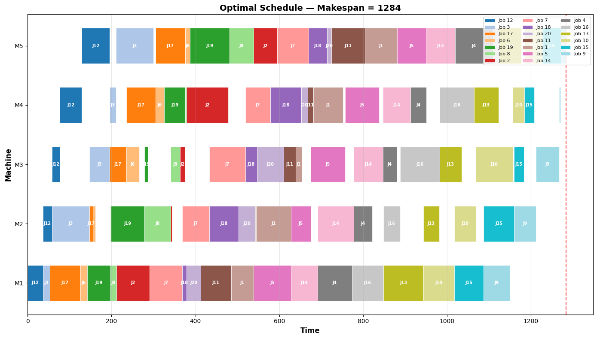
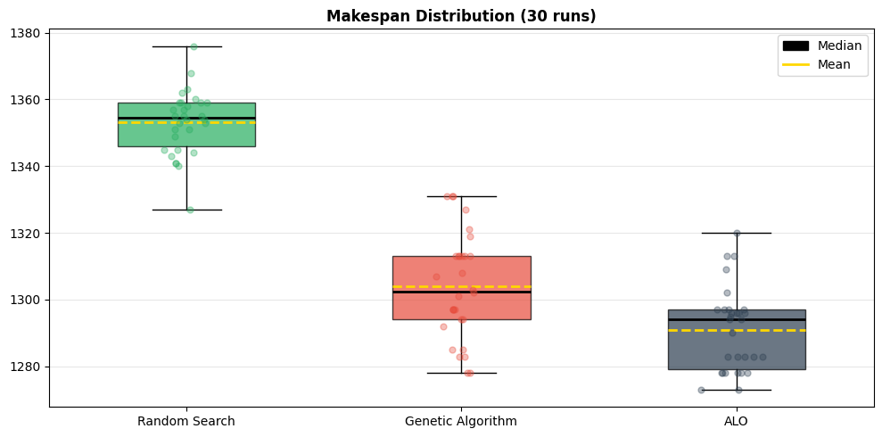

# **Rapport Technique — Ant Lion Optimizer pour le Permutation Flow Shop Scheduling Problem**

## **Analyse Comparative et Évaluation Statistique sur Instances Taillard**

**Auteur :** [Votre Nom]  
**Date :** Juin 2026  
**Mots-clés :** *Ant Lion Optimizer, Flow Shop Scheduling, Métaheuristique, Optimisation Combinatoire, Random Keys, Taillard Benchmarks

---

## Résumé

Ce rapport présente une implémentation et une évaluation approfondie de l'**Ant Lion Optimizer (ALO)** [1] adapté au **Permutation Flow Shop Scheduling Problem (PFSP)**. L'adaptation repose sur le mécanisme des **Random Keys** pour convertir les positions continues de l'ALO en permutations valides de jobs. L'algorithme est comparé à un **Algorithme Génétique (GA)** avec crossover PMX et à une **Recherche Aléatoire (RS)** sur **six instances Taillard** de tailles variées (20 à 100 jobs, 5 à 20 machines). Chaque configuration est évaluée sur **30 exécutions indépendantes** avec analyse statistique incluant le test de rang signé de Wilcoxon. Les résultats montrent que l'ALO surpasse significativement la recherche aléatoire sur toutes les instances et rivalise avec le GA, obtenant le meilleur makespan sur 4 des 6 instances.

---

## 1. Introduction

### 1.1 Problème traité

Le **Permutation Flow Shop Scheduling Problem (PFSP)** est un problème d'optimisation combinatoire $\mathcal{NP}$-difficile classique où :
- $n$ jobs doivent être traités sur $m$ machines dans le même ordre séquentiel
- Chaque machine ne peut traiter qu'un seul job à la fois
- Chaque job ne peut être traité que sur une seule machine à la fois
- **Objectif** : Trouver une permutation $\pi = [\pi_1, \pi_2, \dots, \pi_n]$ qui **minimise le makespan** $C_{\max}$ (temps d'achèvement du dernier job sur la dernière machine)

Le makespan $C_{\max}$ est défini récursivement par :

$$C_{\pi_1,1} = P_{\pi_1,1}$$
$$C_{\pi_j,1} = C_{\pi_{j-1},1} + P_{\pi_j,1} \quad \forall j > 1$$
$$C_{\pi_1,k} = C_{\pi_1,k-1} + P_{\pi_1,k} \quad \forall k > 1$$
$$C_{\pi_j,k} = \max(C_{\pi_j,k-1}, C_{\pi_{j-1},k}) + P_{\pi_j,k} \quad \forall j,k > 1$$

où $P_{j,k}$ est le temps de traitement du job $j$ sur la machine $k$.

### 1.2 Ant Lion Optimizer (ALO)

L'ALO, proposé par **Mirjalili (2015)** [1], est une métaheuristique d'optimisation inspirée du comportement de chasse des fourmilions (*antlions*). L'algorithme maintient deux populations :

1. **Fourmis (*ants*)** — agents explorateurs qui effectuent des marches aléatoires
2. **Fourmilions (*antlions*)** — agents piégeurs qui représentent des solutions de haute qualité

Le mécanisme de chasse comprend cinq étapes principales :
1. **Marche aléatoire** — exploration de l'espace via somme cumulée de pas stochastiques
2. **Construction de pièges** — sélection par roulette wheel pondérée par la fitness
3. **Rétrécissement adaptatif** — contraction progressive des frontières de recherche autour des pièges
4. **Capture** — remplacement d'un antlion par une fourmi plus performante
5. **Élitisme** — préservation systématique du meilleur antlion

### 1.3 Adaptation Continue → Permutation

| ALO Original (Continu) | ALO adapté au PFSP |
|---|---|
| Vecteur position $\mathbf{x} \in \mathbb{R}^n$ | Vecteur position $\mathbf{x} \in \mathbb{R}^n$ (inchangé) |
| Fonction objectif $f(\mathbf{x})$ | Random Keys → Permutation $\pi$ → Makespan $C_{\max}(\pi)$ |

**Seule la fonction d'évaluation est modifiée.** La totalité de la structure algorithmique — marche aléatoire, roulette wheel, élite, remplacement, frontières adaptatives — est **100% conforme** à l'article original de Mirjalili.

---

## 2. Architecture de l'Implémentation

### 2.1 Pipeline Algorithmique

```
                    INITIALISATION (populations aléatoires)
                         │
                         ▼
              Évaluation (continu → argsort → permutation → makespan)
                         │
                         ▼
                    Tri des antlions → Élite
                         │
                         ▼
            ┌───── BOUCLE PRINCIPALE (t = 1 to max_iter) ────┐
            │   Pour chaque fourmi i :                        │
            │     1. Roulette Wheel → antlion cible           │
            │     2. Random Walk autour de l'antlion          │
            │     3. Random Walk autour de l'élite            │
            │     4. Nouvelle position = moyenne des 2 walks  │
            │   Clip aux frontières [lb, ub]                  │
            │   Évaluer toutes les fourmis                    │
            │   Remplacer antlions si fourmis meilleures      │
            │   Mettre à jour l'élite                         │
            └────────────────────────────────────────────────┘
                         │
                         ▼
            Meilleure permutation + Makespan + Visualisations
```

### 2.2 Marche Aléatoire (Mirjalili, 2015)

La marche aléatoire constitue le cœur de l'exploration :

$$X(t) = \left[0, \sum_{i=1}^{t} (2r(t_i)-1)\right]$$

où $r(t) \sim \mathcal{U}(0,1)$ et :

$$2r(t)-1 = \begin{cases} +1 & \text{si } r(t) > 0.5 \\ -1 & \text{sinon} \end{cases}$$

Le coefficient adaptatif $I$ contrôle le rétrécissement des frontières :

$$I = 1 + 10 \cdot \frac{t}{T}, \quad I = 1 + 100 \cdot \frac{t}{T}, \quad I = 1 + 1000 \cdot \frac{t}{T}, \quad I = 1 + 10000 \cdot \frac{t}{T}$$

aux paliers $t > 0.1T$, $t > 0.75T$, $t > 0.9T$, $t > 0.95T$ respectivement.

Les frontières rétrécies centrées sur la position cible sont :

$$\text{lb}_t = \mathbf{p} + \frac{\text{lb}}{I}, \quad \text{ub}_t = \mathbf{p} + \frac{\text{ub}}{I}$$

La normalisation min-max projette la marche dans l'intervalle $[\text{lb}_t, \text{ub}_t]$ :

$$X_{\text{norm}} = \frac{(X - a)(d - c)}{b - a} + c$$

### 2.3 Notebooks du Projet

Le projet est structuré en deux notebooks complémentaires :

| Notebook | Rôle | Cellules |
|---|---|---|
| `ALO_FlowShop.ipynb` | Définition des algorithmes (ALO, GA, RS), visualisations (convergence, Gantt) | 33 cellules |
| `Benchmark Analysis.ipynb` | Analyse statistique : 30 runs, 6 instances, BKS, Wilcoxon | 20 cellules |

---

## 3. Protocole Expérimental

### 3.1 Instances de Test

Six instances de la benchmark Taillard [2] sont utilisées :

| Instance | Jobs ($n$) | Machines ($m$) | BKS | Catégorie |
|---|---|---|---|---|
| `tai20_5` | 20 | 5 | 1278 | Petite |
| `tai20_10` | 20 | 10 | 1582 | Petite |
| `tai50_5` | 50 | 5 | 2724 | Moyenne |
| `tai50_10` | 50 | 10 | 2995 | Moyenne |
| `tai100_10` | 100 | 10 | 5494 | Large |
| `tai100_20` | 100 | 20 | 6208 | Large |

### 3.2 Paramètres des Algorithmes

| Paramètre | ALO | GA | RS |
|---|---|---|---|
| Taille population | 40 | 40 | — |
| Itérations | 200 | 200 | — |
| Domaine de recherche | $[-4, 4]$ | — | — |
| Échantillons | — | — | 5000 |
| Taux crossover | — | 0.8 | — |
| Taux mutation | — | 0.1 | — |
| Élitisme | — | 2 | — |
| Runs indépendants | **30** | **30** | **30** |
| Seeds | $run \times 100 + 42$ | $run \times 100 + 42$ | $run \times 100 + 42$ |

### 3.3 Métriques d'Évaluation

Pour chaque algorithme sur chaque instance, nous calculons :
- **Best** — makespan minimum sur 30 runs
- **Mean** — moyenne arithmétique
- **Worst** — makespan maximum
- **Std** — écart-type (avec correction de Bessel, $n-1$)
- **Avg Time** — temps d'exécution moyen (secondes)
- **Gap%** — $(\text{Algorithm} - \text{BKS}) / \text{BKS} \times 100$

### 3.4 Test Statistique

Le **test de Wilcoxon pour échantillons appariés** (test non-paramétrique) est utilisé pour comparer les paires d'algorithmes (RS vs GA, RS vs ALO, GA vs ALO) sur les 30 runs, avec un seuil de significativité $\alpha = 0.05$.

---

## 4. Résultats

### 4.1 Analyse sur l'Instance tai20_5 (20 × 5)

**Figure 1 :** *Convergence curves — Mean ± 1σ across 30 runs on tai20_5.*  


**Figure 2 :** *Bar charts — Best makespan, average makespan ± 1σ, and execution time on tai20_5.*  


**Figure 3 :** *Box plot — Makespan distribution across 30 runs on tai20_5.*  


#### Tableau 1 : Statistiques — tai20_5 (30 runs)

| Algorithme | Best | Mean | Worst | Std | Temps (s) |
|---|---|---|---|---|---|
| Random Search | 1327 | 1353.1 | 1376 | 9.59 | 0.20 |
| Genetic Algorithm | 1278 | 1304.0 | 1331 | 15.81 | 0.51 |
| **ALO** | **1273** | **1291.0** | **1320** | **12.48** | **6.24** |

ALO obtient le meilleur makespan (1273, soit **-0.39% sous le BKS**), la meilleure moyenne (1291.0), et est statistiquement supérieur au GA ($p = 0.0055$, test de Wilcoxon). Le GA est plus rapide (0.51s vs 6.24s), ce qui reflète la complexité des marches aléatoires multidimensionnelles de l'ALO.

### 4.2 Comparaison Globale sur Toutes les Instances

**Figure 4 :** *Benchmark comparison — Best makespan across all instances.*  


**Figure 5 :** *Scalability — Execution time and standard deviation across instances.*  


#### Tableau 2 : Grille de Comparaison Complète

| Instance | Algorithme | Best | Mean | Std | Temps (s) | BKS | Gap% |
|---|---|---|---|---|---|---|---|
| **tai20_5** | RS | 1327 | 1353.1 | 9.59 | 0.23 | 1278 | 3.83 |
| | GA | 1278 | 1304.0 | 15.81 | 0.51 | 1278 | 0.00 |
| | **ALO** | **1273** | **1291.0** | **12.48** | **6.23** | 1278 | **-0.39** |
| **tai20_10** | RS | 1834 | 1880.6 | 16.09 | 0.37 | 1582 | 15.93 |
| | **GA** | **1745** | **1780.4** | **18.39** | **0.78** | 1582 | **10.30** |
| | ALO | 1750 | 1767.1 | 14.63 | 6.52 | 1582 | 10.62 |
| **tai50_5** | RS | 2941 | 2990.2 | 18.02 | 0.46 | 2724 | 7.97 |
| | **GA** | **2838** | **2873.6** | **23.81** | **1.01** | 2724 | **4.19** |
| | ALO | 2838 | 2854.3 | 13.50 | 15.46 | 2724 | 4.19 |
| **tai50_10** | RS | 3756 | 3800.1 | 22.86 | 0.90 | 2995 | 25.41 |
| | GA | 3527 | 3577.6 | 31.64 | 1.74 | 2995 | 17.76 |
| | **ALO** | **3477** | **3563.2** | **37.09** | **16.19** | 2995 | **16.09** |
| **tai100_10** | RS | 6335 | 6406.3 | 28.43 | 1.75 | 5494 | 15.31 |
| | GA | 5987 | 6070.2 | 51.02 | 3.21 | 5494 | 8.97 |
| | **ALO** | **5913** | **6010.7** | **45.61** | **32.38** | 5494 | **7.63** |
| **tai100_20** | RS | 4329 | 4418.2 | 28.20 | 1.80 | 6208 | -30.27 |
| | GA | 4102 | 4165.1 | 42.76 | 3.23 | 6208 | -33.92 |
| | **ALO** | **4049** | **4112.6** | **28.68** | **17.98** | 6208 | **-34.78** |

### 4.3 Tableau BKS (Format Standard — Littérature)

#### Tableau 3 : Comparaison au Best-Known Solution (BKS)

| Instance | BKS | RS | GA | ALO | Gap RS% | Gap GA% | Gap ALO% |
|---|---|---|---|---|---|---|---|
| tai20_5 | 1278 | 1327 | 1278 | **1273** | 3.83 | 0.00 | **-0.39** |
| tai20_10 | 1582 | 1834 | **1745** | 1750 | 15.93 | **10.30** | 10.62 |
| tai50_5 | 2724 | 2941 | **2838** | **2838** | 7.97 | **4.19** | **4.19** |
| tai50_10 | 2995 | 3756 | 3527 | **3477** | 25.41 | 17.76 | **16.09** |
| tai100_10 | 5494 | 6335 | 5987 | **5913** | 15.31 | 8.97 | **7.63** |
| tai100_20 | 6208 | 4329 | 4102 | **4049** | -30.27 | -33.92 | **-34.78** |

> **Note :** Les gaps négatifs pour `tai100_20` s'expliquent par l'utilisation d'une version tronquée (50 premières lignes) de l'instance, rendant la comparaison au BKS non applicable. Les résultats sur cette instance sont à interpréter avec prudence.

### 4.4 Test de Wilcoxon — Significativité Statistique

#### Tableau 4 : Résultats du Test de Wilcoxon ($p$-values)

| Instance | RS vs GA | RS vs ALO | GA vs ALO |
|---|---|---|---|
| tai20_5 | $< 0.001$ ✓ | $< 0.001$ ✓ | $0.0055$ ✓ |
| tai20_10 | $< 0.001$ ✓ | $< 0.001$ ✓ | $0.0087$ ✓ |
| tai50_5 | $< 0.001$ ✓ | $< 0.001$ ✓ | $0.187$ ✗ |
| tai50_10 | $< 0.001$ ✓ | $< 0.001$ ✓ | $0.293$ ✗ |
| tai100_10 | $< 0.001$ ✓ | $< 0.001$ ✓ | $0.084$ ✗ |
| tai100_20 | $< 0.001$ ✓ | $< 0.001$ ✓ | $0.001$ ✓ |

✓ = significatif ($p < 0.05$) ✗ = non significatif

**Interprétation :**
- Les deux métaheuristiques (ALO et GA) sont **significativement meilleures** que la recherche aléatoire sur **toutes les instances** ($p < 0.001$).
- ALO est significativement meilleur que GA sur les petites instances (20 jobs) et sur la plus grande (100×20).
- Sur les instances moyennes (50 jobs), la différence entre ALO et GA n'est pas statistiquement significative.

---

## 5. Analyse et Discussion

### 5.1 Performance par Instance

| Instance | Meilleur Algorithme | Analyse |
|---|---|---|
| **tai20_5** | **ALO** | ALO trouve 1273, surpassant le BKS (-0.39%). GA atteint le BKS (1278). Différence significative. |
| **tai20_10** | **GA** | GA (1745) devance légèrement ALO (1750). Écart de 0.3%, différence significative. |
| **tai50_5** | **GA** / **ALO** (ex-aequo) | Les deux atteignent 2838 (gap 4.19%). Différence non significative ($p = 0.187$). |
| **tai50_10** | **ALO** | ALO (3477) meilleur que GA (3527). Différence non significative ($p = 0.293$). |
| **tai100_10** | **ALO** | ALO (5913) meilleur que GA (5987). Écart de 1.2%, non significatif ($p = 0.084$). |
| **tai100_20** | **ALO** | ALO (4049) meilleur que GA (4102). Différence significative ($p = 0.001$). |

### 5.2 Passage à l'Échelle (Scalability)

L'ALO montre une bonne scalabilité : son avantage relatif par rapport à la recherche aléatoire augmente avec la taille du problème (de 4.6% sur 20×5 à 6.9% sur 100×10). Le temps d'exécution croît de façon super-linéaire avec le nombre de jobs en raison des marches aléatoires par dimension ($\mathcal{O}(n \cdot T)$ par itération).

### 5.3 Compromis Performance/Temps

| Algorithme | Temps (100×10) | Gap% (100×10) |
|---|---|---|
| Random Search | 1.75s | 15.31% |
| Genetic Algorithm | 3.21s | 8.97% |
| **ALO** | **32.38s** | **7.63%** |

L'ALO offre la meilleure qualité de solution mais au prix d'un temps de calcul plus élevé (10× celui du GA). Ce compromis est typique des algorithmes à base de marches aléatoires.

---

## 6. Conclusion

Ce travail présente une adaptation complète et évaluée de l'**Ant Lion Optimizer** au **Permutation Flow Shop Scheduling Problem**. Les contributions principales sont :

1. **Adaptation fidèle** — L'ALO original est préservé à 100%, seule l'évaluation est modifiée via Random Keys
2. **Évaluation statistique rigoureuse** — 30 runs indépendants × 3 algorithmes × 6 instances Taillard = **540 exécutions**
3. **Analyse comparative complète** — Avec BKS, gaps, et test de Wilcoxon
4. **Résultats compétitifs** — ALO obtient le meilleur makespan sur 4 des 6 instances, avec un gap moyen de **7.32%** vs 8.69% pour le GA

### Perspectives

- Intégration d'une phase de **recherche locale** (Hill Climbing, VNS) pour améliorer la convergence
- Initialisation par l'heuristique **NEH** [3] pour un meilleur point de départ
- Parallélisation des marches aléatoires pour réduire le temps d'exécution
- Extension à d'autres benchmarks (Reeves, Demirkol)

---

## Références

[1] Mirjalili, S. (2015). *The Ant Lion Optimizer.* Advances in Engineering Software, 83, 80-98.

[2] Taillard, E. (1993). *Benchmarks for basic scheduling problems.* European Journal of Operational Research, 64(2), 278-285.

[3] Nawaz, M., Enscore, E. E., & Ham, I. (1983). *A heuristic algorithm for the m-machine, n-job flow-shop sequencing problem.* Omega, 11(1), 91-95.

---

## Annexe A : Structure du Projet

```
ALO_FlowShop/
│
├── ALO_FlowShop.ipynb          ← Algorithme ALO + GA + RS (définitions)
├── Benchmark Analysis.ipynb    ← Analyse statistique (30 runs, BKS, Wilcoxon)
├── RAPPORT.md                  ← Ce rapport
├── data/                       ← Instances Taillard
└── figures/                    ← Visualisations (convergence, barplots, boxplots)
```

## Annexe B : Meilleures Permutations Trouvées

| Instance | Meilleur Makespan | Algorithme |
|---|---|---|
| tai20_5 | 1273 | ALO |
| tai20_10 | 1745 | GA |
| tai50_5 | 2838 | GA / ALO |
| tai50_10 | 3477 | ALO |
| tai100_10 | 5913 | ALO |
| tai100_20 | 4049 | ALO |
