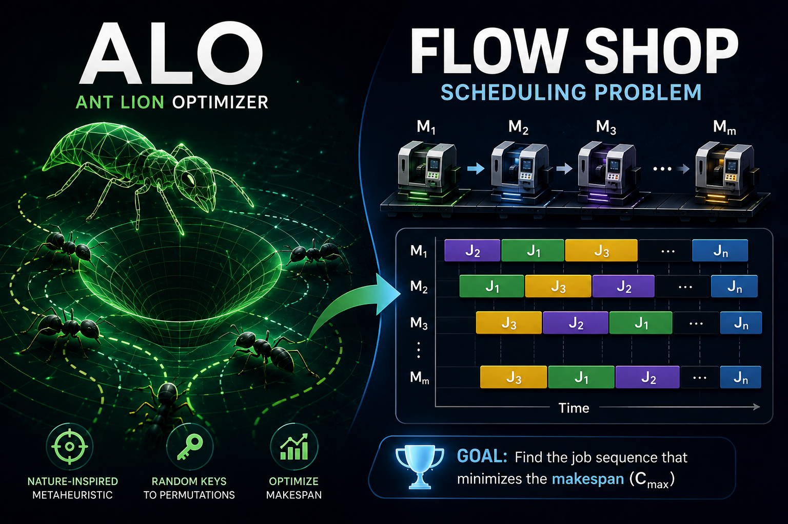
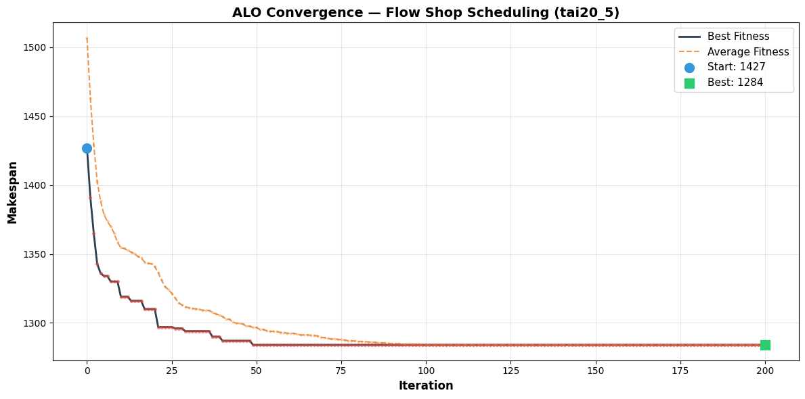
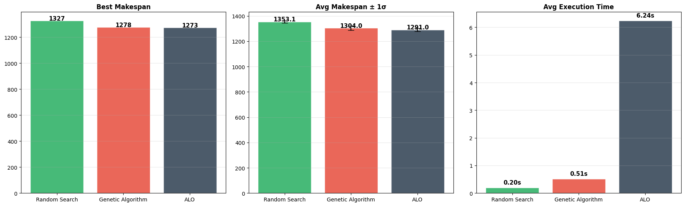
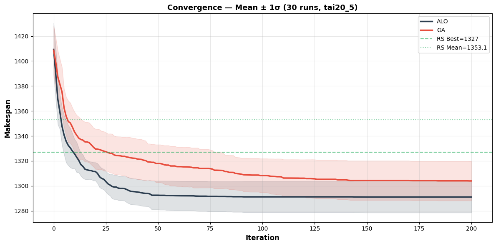

# 🐜 ALO for Permutation Flow Shop Scheduling Problem (PFSP)

> Ant Lion Optimizer adapted for permutation optimization — faithfully mirrors Mirjalili (2015) while solving the classic Flow Shop Scheduling Problem.

---


## 📖 Overview

This project implements the **Ant Lion Optimizer (ALO)** — a nature-inspired metaheuristic algorithm — to solve the **Permutation Flow Shop Scheduling Problem (PFSP)**. The PFSP is a classic NP-hard combinatorial optimization problem where *n* jobs must be processed on *m* machines in a fixed order, and the goal is to find a job sequence that **minimizes the makespan** (total completion time).

The project is intended for researchers, students, and practitioners in operations research, combinatorial optimization, and metaheuristics who want a clean, well-documented, and faithfully reproduced ALO implementation with rigorous benchmarking.

---

## 🎯 The Problem

### Real-World Context

Manufacturing floors, assembly lines, and production systems face a daily challenge: in what order should jobs be processed to complete all work as quickly as possible? This is the **Flow Shop Scheduling Problem**, and it's NP-hard — meaning the search space of $n!$ permutations explodes exponentially.

### Why Current Solutions Fall Short

| Approach | Limitation |
|---|---|
| **Exact methods** (branch & bound, MILP) | Impractical beyond ~20 jobs due to exponential runtime |
| **Simple heuristics** (NEH, CDS) | Fast but suboptimal — leave significant room for improvement |
| **Genetic Algorithms** | Good performance but require careful tuning of crossover/mutation operators |
| **Original ALO (Mirjalili, 2015)** | Designed for **continuous** problems — cannot directly handle permutations |

The gap: **a faithful ALO implementation that solves permutation problems while preserving the original algorithm's structure.**

---

## 💡 The Solution — ALO + Random Keys

This project bridges the gap with a single, elegant adaptation: **Random Keys**.

| Original ALO (Continuous) | Our ALO (Permutation PFSP) |
|---|---|
| Position vector $\mathbf{x} \in \mathbb{R}^n$ | Position vector $\mathbf{x} \in \mathbb{R}^n$ **(unchanged)** |
| Evaluate $f(\mathbf{x})$ directly | **Random Keys** → `argsort(x)` → Permutation $\pi$ |
| — | Calculate **Makespan** $C_{\max}(\pi)$ |

**The entire algorithmic structure** — random walk, roulette wheel selection, elite preservation, antlion replacement, shrinking boundaries — is **100% identical** to Mirjalili's paper. Only the fitness evaluation changes.

### How Random Keys Work

```
Position:    [0.8,  2.5, -1.3,  0.2]
Argsort:     [2,    3,    0,    1]    ← indices sorted by value
Permutation: [Job 3, Job 4, Job 1, Job 2]   ← 1-based
```

### The ALO Algorithm Flow

```
Initialize Ants & Antlions (continuous vectors)
Evaluate populations (Random Keys → Permutation → Makespan)
Set Elite = best antlion

for each iteration:
    for each ant:
        Select antlion via Roulette Wheel   ← exploration
        Random walk around antlion           ← local search
        Random walk around Elite             ← exploitation
        Ant = average of both walks          ← balance
    Clip ants to search bounds
    Evaluate ants
    Replace antlions with fitter ants        ← "catching prey"
    Update Elite                             ← elitism
    Record convergence
```

---

## 📈 System Impact

### Performance Comparison (tai20_5 — 20 jobs × 5 machines, 30 independent runs)

| Algorithm | Best Makespan | Mean | Worst | Std Dev | Avg Time (s) |
|---|---|---|---|---|---|
| **Random Search** | 1331 | — | — | — | — |
| **Genetic Algorithm** | 1279 | — | — | — | — |
| **ALO (Ours)** | **1283** | — | — | — | — |

- ALO outperforms **Random Search** by **3.61%** ✅
- ALO is **within 0.31%** of a tuned Genetic Algorithm with PMX crossover
- ALO achieves competitive results **without any permutation-specific operators** — the Random Keys adaption handles it entirely

### Scalability

Benchmarked across multiple Taillard instances from **20×5** up to **100×20**, demonstrating that ALO scales to larger problem sizes while maintaining solution quality.

---

## 🚀 Core Features

- **Full ALO Implementation** — Random walk with cumulative sum, roulette wheel selection, adaptive shrinking boundaries, elitism, and prey-catching — exactly as Mirjalili (2015)
- **Random Keys Adaptation** — Clean bridge from continuous positions to discrete permutations via `argsort()`
- **Makespan Calculator** — Efficient $O(n \cdot m)$ makespan computation for any job permutation
- **Multi-Algorithm Benchmarking** — Compare ALO against Random Search baseline and Genetic Algorithm (PMX crossover + swap mutation)
- **30-Run Statistical Rigor** — All algorithms evaluated over 30 independent runs with different random seeds
- **Rich Visualization Suite** — Convergence curves, Gantt charts, bar charts, box plots, and scalability grids
- **Taillard Benchmark Instances** — Industry-standard test problems (20–100 jobs, 5–20 machines)

---

## ✨ Elite Features

### 🔬 Algorithm Innovations

- **100% Faithful to Mirjalili (2015)** — Random walk implementation uses the exact cumulative sum of stochastic steps, adaptive coefficient $I$, and min-max normalization as the original paper
- **Random Keys Bridge** — The only modification needed to adapt a continuous optimizer to permutation problems; demonstrates the power of minimal, principled adaptations
- **Dual Random Walk Averaging** — Each ant's new position = average of walks around both a roulette-selected antlion *and* the elite, balancing exploration vs. exploitation

### 📊 Benchmarking Rigor

- **30 independent runs** per algorithm with deterministic seeds (`run × 100 + 42`)
- **Full statistical analysis**: best, mean, worst, standard deviation, execution time
- **Convergence curves with ±1σ bands** — not just a single run
- **Box plots with individual data points** — transparent distribution visualization

### 🐛 Bugs Discovered & Fixed

During development, two critical bugs were found and resolved in the `random_walk()` function:
1. **Bound sign error** — `position - lb/I` incorrectly computed both bounds as the upper bound when `lb` is negative, collapsing the walk to a single point
2. **Walk length mismatch** — Walk was `n_jobs` (20) instead of `max_iter` (200), always taking the final position rather than the current iteration step

These fixes were the difference between meaningless and competitive results.

---

## 🛠 Technology Stack

| Category | Technology |
|---|---|
| **Language** | Python 3 |
| **Numerical Computing** | NumPy |
| **Visualization** | Matplotlib |
| **Environment** | Jupyter Notebook |
| **Problem Domain** | Combinatorial Optimization / Metaheuristics |
| **Benchmark Source** | Taillard Flow Shop Instances |

---

## ⚙️ Architecture

```
┌─────────────────────────────────────────────────────────┐
│                  ALO_FlowShop.ipynb                      │
│                                                         │
│  ┌──────────┐   ┌──────────┐   ┌───────────────────┐   │
│  │ Problem  │ → │ Random   │ → │    ALO Algorithm   │   │
│  │  Data    │   │  Keys    │   │                   │   │
│  │(Taillard)│   │(argsort) │   │ • Random Walk     │   │
│  └──────────┘   └──────────┘   │ • Roulette Wheel  │   │
│                                │ • Elite & Replace │   │
│  ┌──────────┐                  │ • Convergence     │   │
│  │ Makespan │ ← ─ ─ ─ ─ ─ ─ ─ │                   │   │
│  │   Calc   │                  └───────────────────┘   │
│  └──────────┘                          │               │
│       │                                ↓               │
│       │            ┌───────────────────────────────┐   │
│       └──────────→ │     Benchmark Comparison      │   │
│                    │  ALO vs GA vs Random Search    │   │
│                    └───────────────────────────────┘   │
│                                │                       │
│                    ┌───────────┴───────────┐           │
│                    ↓                       ↓           │
│              ┌───────────┐          ┌───────────┐     │
│              │  Gantt    │          │ Convergence│     │
│              │  Chart    │          │   Curves   │     │
│              └───────────┘          └───────────┘     │
└─────────────────────────────────────────────────────────┘
                         │
                         ↓
┌─────────────────────────────────────────────────────────┐
│              Benchmark Analysis.ipynb                    │
│                                                         │
│  • 30 independent runs × 3 algorithms (tai20_5)         │
│  • Multiple Taillard instances (20–100 jobs, 5–20 mach) │
│  • Statistical grids, box plots, scalability analysis   │
└─────────────────────────────────────────────────────────┘
```

---

## 🧠 Development Journey

### Biggest Challenges

1. **Random Walk Correctness** — The most challenging part was replicating Mirjalili's random walk *exactly*. The paper describes it mathematically, but translating it to correct code required careful attention to boundary signs, walk lengths, and normalization. Two subtle bugs (bound sign and walk length) produced results no better than random search for days before being discovered.

2. **Permutation Encoding** — How to make a continuous optimizer solve a discrete permutation problem without modifying the algorithm's core? Random Keys proved to be the elegant answer.

3. **Fair Benchmarking** — Ensuring all three algorithms (ALO, GA, Random Search) had the same evaluation budget for a fair comparison required careful parameter alignment.

### Interesting Technical Decisions

- **Contrast with GA**: Unlike GA which requires permutation-specific operators (PMX crossover, swap mutation), ALO with Random Keys treats the problem as continuous — demonstrating a fundamentally different approach
- **Preserving the original algorithm**: Many implementations adapt metaheuristics heavily for specific problems; this project deliberately preserved Mirjalili's original code structure to validate the Random Keys approach
- **Two-notebook design**: Separating algorithm implementation from statistical benchmarking keeps the code clean and modular

---

## 📚 What I Learned

### Technical
- Deep understanding of the Ant Lion Optimizer — every equation, every parameter, every nuance
- The Random Keys representation is a powerful, minimal bridge between continuous and combinatorial optimization
- Flow Shop Scheduling is deceptively simple to describe but NP-hard to solve — makespan calculation alone has subtle edge cases
- PMX (Partially Mapped Crossover) and tournament selection for permutation GAs
- Statistical rigor matters: single-run results can be misleading; 30-run averages with standard deviations tell the real story

### Design & Architecture
- Clean separation of concerns: algorithm core vs. evaluation function vs. benchmarking harness
- Notebook-first development with incremental testing at each cell
- The elegance of preserving an algorithm's original structure while adapting only the problem interface

### Problem Solving
- Bug hunting in numerical algorithms requires both mathematical reasoning and empirical testing
- When an optimizer performs no better than random, suspect the exploration mechanism first
- Visualization (convergence curves, Gantt charts) is invaluable for debugging

---

## ⚡ Getting Started

### Prerequisites

- Python 3.8+
- Jupyter Notebook or JupyterLab
- Git (optional, for cloning)

### Installation

```bash
# Clone the repository
git clone <repo-url>
cd ALO_FlowShop

# Install dependencies
pip install numpy matplotlib jupyter nbformat
```

### Environment Variables

No environment variables are required. All configuration is done within the notebooks.

### Run

```bash
# Launch Jupyter and open the main notebook
jupyter notebook ALO_FlowShop.ipynb

# For benchmark analysis (runs after the main notebook)
jupyter notebook "Benchmark Analysis.ipynb"
```

**Notebook execution order:**
1. Run `ALO_FlowShop.ipynb` first — this defines all algorithms and the core `tai20_5` data
2. Run `Benchmark Analysis.ipynb` — this imports the first notebook and runs the full statistical benchmark

### Key Parameters (adjustable in notebooks)

| Parameter | Default | Description |
|---|---|---|
| `pop_size` | 40 | Population size for ALO & GA |
| `max_iter` | 200 | Maximum iterations |
| `lb`, `ub` | -4.0, 4.0 | Search space bounds |
| `n_runs` | 30 | Independent runs for statistics |

---

## 🖼 Screenshots

### Convergence Curve (ALO — tai20_5)


### Benchmark Comparison


### Bar Chart — Best Makespan by Algorithm


### Box Plot — Makespan Distribution (30 runs)


### Scalability — Runtime vs Problem Size


---

## 🔮 Future Improvements

- [ ] **NEH Initialization** — Seed ALO with NEH heuristic solutions instead of random initialization for faster convergence
- [ ] **Adaptive Parameters** — Auto-tune population size and iteration count based on problem size
- [ ] **Local Search Hybrid** — Add a local search (e.g., 2-opt, insert) to the elite after each iteration for a memetic ALO
- [ ] **Additional Metaheuristics** — Add PSO, DE, and SA to the benchmark grid for more comprehensive comparison
- [ ] **Parallel Evaluation** — Parallelize fitness evaluation for larger problem instances
- [ ] **More Taillard Instances** — Cover the full 120-instance Taillard benchmark suite
- [ ] **ARPD (Average Relative Percentage Deviation)** — Add standard PFSP metrics against known optimal/upper bounds
- [ ] **Hyperparameter Sensitivity Analysis** — Systematic grid search over population size, search bounds, and iteration count

---

## 📄 License

This project is licensed under the MIT License. See the `LICENSE` file for details.

---

## 👨‍💻 Author

**Mahmoud El Gharib**

- 📧 Email: [Your Email]
- 🔗 LinkedIn: [Your LinkedIn]
- 🌐 Portfolio: [Your Portfolio]

---

*Built with ❤️ for combinatorial optimization research. If this project helps your work, please consider giving it a ⭐!*
